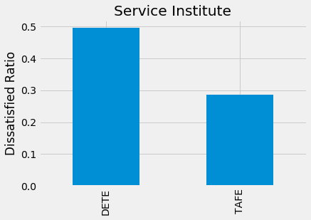

# Using Pandas to Clean and Analyze Employee Exit Surveys

## Introduction
Hi, I'm Kambhampati Dhanush. I'm currently a final-year Biomedical Engineering student at NIT Rourkela. My interest in data analysis and data science stems from my passion for uncovering stories hidden in data and making informed decisions based on empirical evidence. This project, which involves analyzing employee exit surveys from the Department of Education, Training and Employment (DETE) and the Technical and Further Education (TAFE) institute in Queensland, Australia, aligns perfectly with this interest. The main aim was to clean and analyze the data to address specific questions about employee dissatisfaction and resignation patterns.

## Data
The DETE exit survey can be found [here](https://data.gov.au/dataset/ds-qld-89970a3b-182b-41ea-aea2-6f9f17b5907e/details?q=exit%20survey), and the TAFE exit survey is available [here](https://data.gov.au/dataset/ds-qld-89970a3b-182b-41ea-aea2-6f9f17b5907e/details?q=exit%20survey). A modified version of these datasets (encoding changed from cp1252 to UTF-8) was provided by [DataQuest](https://www.dataquest.io/) as `dete_survey.csv` and `tafe_survey.csv`.

- The `dete_survey` dataframe contains 822 entries and 56 columns. Every column except `Id` is of object or boolean datatype. Missing values are filled as _`Not Stated`_. Key columns used include:
  - `SeparationType`: The reason why the person's employment ended
  - `Cease Date`: The year or month the person's employment ended
  - `DETE Start Date`: The year the person began employment with DETE
  - `Job dissatisfaction`: Whether job dissatisfaction was the reason for separation

- The `tafe_survey` dataframe has 702 entries and 72 columns, with all columns except `Record ID` and `CESSATION YEAR` being of object data types. Key columns used include:
  - `Contributing Factors. Job Dissatisfaction`: Whether job dissatisfaction was a contributing factor for ending employment
  - `Reason for ceasing employment`: The reason why the person's employment ended
  - `LengthofServiceOverall. Overall Length of Service at Institute (in years)`: The length of the person's employment in years

## Technologies and Techniques
Our objective was to combine both surveys and answer the questions about employee dissatisfaction. Even though the surveys followed a similar template, some answers were customized. With no data dictionary provided, we relied on our understanding to merge and clean the columns. Key steps included:

- Dropping unnecessary columns, e.g., `Aboriginal`, `Torres Strait`, `South Sea` in `dete_survey` and `Workplace. Topic:Would you recommend the Institute as an employer to others?` in `tafe_survey`, keeping only those related to job dissatisfaction.
- Filtering data to include only employees who marked 'Resignation' as a reason for separation.
- Cleaning and standardizing column names. Some columns we focused on:

  | dete_survey | tafe_survey | Definition | New Name |
  |-------------|-------------|------------|----------|
  | SeparationType | Reason for ceasing employment | The reason why the participant's employment ended | separationtype |
  | Cease Date | CESSATION YEAR | The year or month the participant's employment ended | cease_date |
  | DETE Start Date | | The year the participant began employment with DETE | dete_start_date |
  | | LengthofServiceOverall. Overall Length of Service at Institute (in years) | The length of the person's employment (in years) | institute_service |
  | Age | CurrentAge. Current Age | The age of the participant | age |
  | Gender | Gender. What is your Gender? | The gender of the participant | gender |

- Adding new columns, such as `institute_service` in `dete_survey` (calculated as `cease_date - dete_start_date`) to determine the number of years the employee worked. A similar column existed in `tafe_survey`.
- Combining datasets, handling missing values, and cleaning columns for analysis.

## Conclusion

|   |   |
|---|---|
|  |  |
|  |  |
|  | 

We organized and cleaned employee exit survey data from DETE and TAFE in Queensland, Australia. Key observations include:

* Dissatisfaction was more prevalent among employees with over 7 years of experience, with 51% resigning due to it.
* Employees over 60 years old were 52% more dissatisfied at the time of leaving compared to 37% of employees aged 21-30.
* Male and female employees were equally likely to resign due to dissatisfaction, with males slightly higher at 42% compared to females at 37%.
* DETE employees (49%) showed higher dissatisfaction compared to TAFE employees (28%) at the time of resignation.
* Most dissatisfied ex-employees worked in teaching roles and were permanent employees.

## Future Analysis
Future analyses could incorporate `WorkUnit Views` and `Institute Views` columns to identify specific features that may be highly disagreeable. This could help pinpoint reasons for employee dissatisfaction, such as dissatisfaction with growth opportunities or work-life balance.

## What I Learned
* Data extraction, cleaning, and organization are crucial parts of the data science process.
* Utilized pivot tables to summarize data meaningfully and applied functions to rows/columns of a dataframe.
* Combined datasets effectively.

---

**Project by: Kambhampati Dhanush**  
*Final Year, Biomedical Engineering*  
*DOB: 29 December 2003*  
*Contact: +91 6303455517*  
*Email: dhanushkambhampati2912@gmail.com*  
*Education: B.Tech., Biomedical Engineering, NIT Rourkela (2021–Present)*
